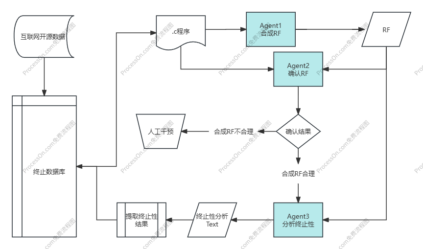

# Agent协作框架



一个用于C程序终止性分析的Agent协作框架，包含三个专门的AI Agent：

- **Agent1**: 程序分析与秩函数合成
- **Agent2**: 秩函数验证  
- **Agent3**: 终止性分析

## 框架结构

```
Agent/
├── agent_framework.py    # 核心Agent协作框架
├── chat_interface.py     # AI聊天接口（可替换为实际实现）
├── config.py            # 配置文件和系统提示词
├── utils.py             # 实用工具函数
├── main.py              # 主入口程序
├── usage_examples.py    # 使用示例
└── Readme.md           # 本文档
```

## 功能特性

### 核心功能
- 🔍 **程序分析**: 自动读取和解析C程序文件
- 🧮 **秩函数合成**: Agent1分析程序结构，合成合适的秩函数
- ✅ **函数验证**: Agent2验证秩函数的正确性和有效性
- 🎯 **终止性判断**: Agent3基于验证通过的秩函数分析程序终止性
- 📊 **批量处理**: 支持目录级别的批量分析
- 📈 **结果导出**: 支持JSON、CSV、HTML格式的结果导出

### 辅助功能
- 📝 **程序结构分析**: 识别循环、函数、递归等结构
- 📊 **统计分析**: 提供详细的分析结果统计
- 🎨 **可视化报告**: 生成美观的HTML分析报告
- 🔧 **交互模式**: 支持命令行交互式操作

## 快速开始

### 1. 基本使用

```python
from agent_framework import AgentCoordinator

# 创建协调器
coordinator = AgentCoordinator()

# 分析单个程序
analysis = coordinator.analyze_program("program.c")

# 打印结果
coordinator.print_analysis_summary(analysis)
```

### 2. 命令行使用

```bash
# 分析单个文件
python main.py analyze program.c -o results/

# 批量分析目录
python main.py batch ../TPDB_YES -o results/

# 分析程序结构
python main.py structure program.c

# 交互模式
python main.py interactive
```

### 3. 批量分析示例

```python
from agent_framework import AgentCoordinator
from utils import StatisticsAnalyzer, ResultExporter

coordinator = AgentCoordinator()

# 批量分析
results = coordinator.batch_analyze("../TPDB_YES")

# 生成统计信息
stats = StatisticsAnalyzer.calculate_statistics(results)
StatisticsAnalyzer.print_statistics(stats)

# 导出结果
ResultExporter.export_to_csv(results, "results.csv")
ResultExporter.export_to_json(results, "results.json")
```

## Agent工作流程

### 1. Agent1 - 秩函数合成
- 分析C程序的循环和递归结构
- 识别程序变量的变化模式
- 合成合适的秩函数表达式
- 返回格式: `RANKING_FUNCTION: expression`

### 2. Agent2 - 秣函数验证
- 验证秩函数在每次迭代中是否严格递减
- 检查函数是否有合理的下界
- 分析函数与程序逻辑的一致性
- 返回格式: `VALIDATION_RESULT: VALID/INVALID`

### 3. Agent3 - 终止性分析
- 基于验证通过的秩函数分析终止性
- 考虑所有可能的执行路径
- 提供终止性证明或反例
- 返回格式: `TERMINATION_RESULT: TERMINATE/NON_TERMINATE/UNKNOWN`

## 配置说明

### 系统提示词配置
在`config.py`中可以自定义各Agent的系统提示词：

```python
AGENT1_SYSTEM_PROMPT = "你是一个专门分析C程序并合成秩函数的专家..."
AGENT2_SYSTEM_PROMPT = "你是一个专门验证秩函数正确性的专家..."  
AGENT3_SYSTEM_PROMPT = "你是一个专门进行程序终止性分析的专家..."
```

### 运行配置
```python
CONFIG = {
    "max_retries": 3,           # 最大重试次数
    "timeout_seconds": 60,      # 超时时间
    "log_level": "INFO",        # 日志级别
    "output_format": "detailed" # 输出格式
}
```

## 结果格式

### 分析结果数据结构
```python
@dataclass
class ProgramAnalysis:
    program_path: str                    # 程序文件路径
    program_content: str                 # 程序内容
    ranking_function: Optional[str]      # 秩函数
    is_ranking_valid: bool              # 验证结果
    termination_result: AnalysisResult  # 终止性结果
    analysis_log: list                  # 分析日志
```

### 终止性结果枚举
```python
class AnalysisResult(Enum):
    TERMINATE = "TERMINATE"         # 程序终止
    NON_TERMINATE = "NON_TERMINATE" # 程序不终止
    UNKNOWN = "UNKNOWN"             # 无法确定
    ERROR = "ERROR"                 # 分析错误
```

## 扩展和定制

### 1. 替换AI接口
将`chat_interface.py`替换为您的实际AI接口实现：

```python
class ChatInterface:
    def setup_system(self, system_prompt: str):
        # 设置系统提示词
        pass
    
    def ask_question(self, program: str) -> str:
        # 调用AI接口
        pass
```

### 2. 自定义Agent
继承基础Agent类并重写相关方法：

```python
class CustomAgent1(Agent1_RankingFunctionSynthesis):
    def analyze_program(self, program_content: str) -> str:
        # 自定义分析逻辑
        pass
```

### 3. 添加新的分析功能
在`utils.py`中添加新的分析工具：

```python
class CustomAnalyzer:
    @staticmethod
    def custom_analysis(program_content: str):
        # 自定义分析功能
        pass
```

## 示例程序测试

框架包含完整的使用示例，运行`usage_examples.py`查看：

```bash
python usage_examples.py
```

示例包括：
1. 单个程序分析示例
2. 批量分析示例  
3. 自定义分析流程示例
4. 分步分析示例

## 注意事项

1. **AI接口**: 当前包含的`chat_interface.py`是模拟实现，请替换为实际的AI接口
2. **程序复杂度**: 复杂程序可能需要更长的分析时间
3. **结果准确性**: 分析结果依赖于AI模型的能力和提示词质量
4. **文件格式**: 目前支持`.c`和`.C`格式的C程序文件

## 贡献指南

欢迎贡献代码和改进建议！请遵循以下步骤：

1. Fork项目
2. 创建功能分支
3. 提交更改
4. 创建Pull Request

## 许可证

本项目采用MIT许可证，详见LICENSE文件。