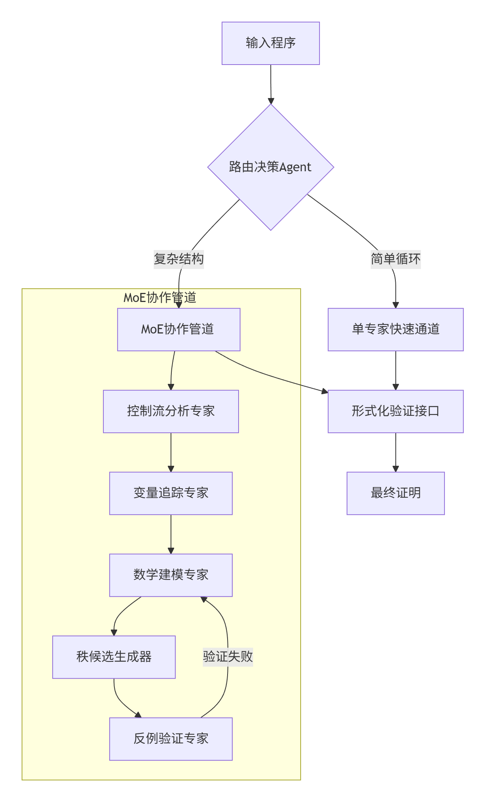

# LLM Strategy

## 大模型选择
Coder模型，或者推理模型；
- 通义 （百炼平台可用）
    - 通义千问-Coder-Plus
    - 通义千问-Coder-32B
- deepseek-coder
- codeLLama

## 微调
- SFT
需要高质量的 QA对 数据集

## Prompt
分布验证
```python
prompt_template = """
请严格按步骤分析以下C循环的终止性：
1. [必须输出]识别所有循环变量，按影响度排序
   - 主变量：{main_var} 
   - 辅助变量：{aux_vars}

2. [必须证明]建立变量变化的不等式：
   {var_inequality}

3. 生成3个候选秩函数，需满足：
   a) {f1} 在循环体内严格递减
   b) {f2} 有明确下界
   c) {f3} 覆盖所有执行路径

4. 对每个候选执行验证：
   - 用Z3验证单调性
   - 构造边界反例测试
   - 输出最终通过的函数
   
目标代码：
{user_code}
"""
```
应该只能保证一个基础的分析正确率

## Agent



- AutoGen： Agent协作
- MoE： 混合专家

多个Agent协作分析：
- 控制流Agent：
    识别出 循环的类型（嵌套多少层，循环关键字）
    提取出 循环条件
    建立一个可供分析的 CFG
- 变量追踪：
    检测变量的 线性和非线性变化形式
    检测变量的 初始值和最终值
- 数学建模Agent：
    推导变量下界？
- 秩函数合成Agent
    根据以上Agent的信息分析
    合成一个 秩函数

- MoE路由：
    大模型评估代码复杂度（线性非线性等），选择是否采用autoGen Agent或者单一Agent去解决；

这个流程应该可以通过 Trae 进行基本模拟实现；
Trae搭建Agent比较快捷方便。